# Entorno de desarrollo Laravel con Sails

## Requisitos previos

Antes de comenzar, asegúrate de tener instalados los siguientes componentes en tu sistema operativo:

- Docker Desktop (en ejecución).
- WSL 2 (si utilizas Windows).
- Terminal o consola de comandos.

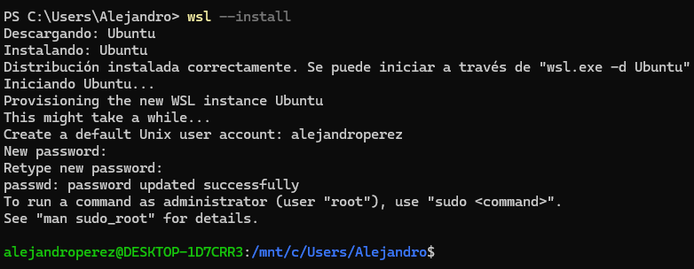

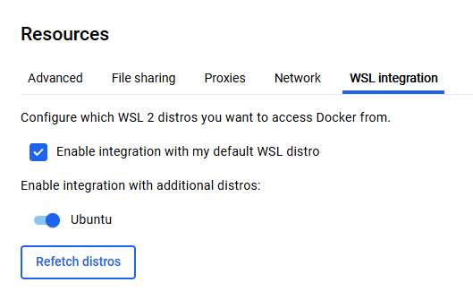

## Creación del Scaffolding del Proyecto

En lugar de instalar PHP o Composer localmente, utilizaremos un contenedor temporal de Docker para generar la estructura del proyecto.

1. Abre tu terminal y navega hasta la carpeta donde deseas alojar el proyecto.

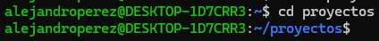

2. Ejecuta el siguiente comando (sustituye nombre-del-proyecto por el nombre que desees):

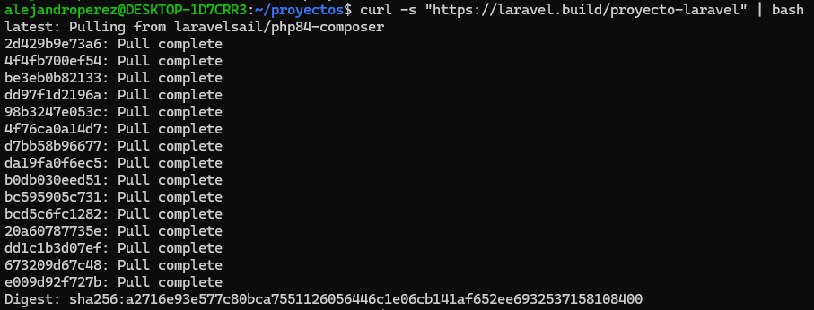

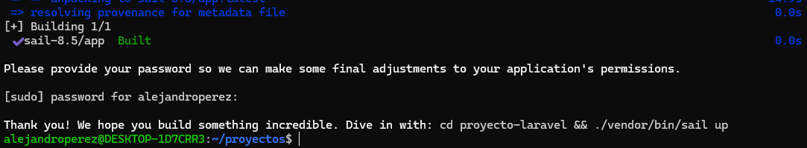

Este script descargará una imagen de Docker con PHP y Composer, creará la carpeta del proyecto y descargará todas las dependencias necesarias de Laravel.

## Configuración de Laravel Sail

Laravel Sail es una interfaz de línea de comandos ligera para interactuar con el entorno Docker predeterminado de Laravel.

1. Accede al directorio recién creado e inicia el entorno de contenedores por primera vez:

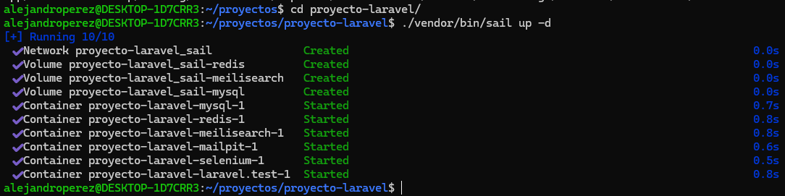

Nota: El parámetro -d permite que los contenedores se ejecuten en segundo plano (detached mode).

## Gestión de Servicios y Contenedores

Laravel Sail configura automáticamente un stack completo que incluye:

- PHP 8.x
- Nginx (Servidor Web)
- MySQL (Base de datos)
- Redis (Caché)

Para verificar que los contenedores están funcionando correctamente, puedes listar los servicios activos:

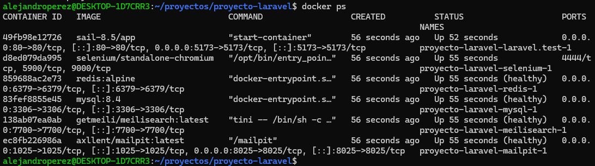

## Ejecución de Migraciones y Pruebas

Una vez que los contenedores estén activos, debemos preparar la base de datos y verificar el acceso al framework.

1. Migrar la base de datos: Ejecuta el siguiente comando para crear las tablas iniciales dentro del contenedor de MySQL:

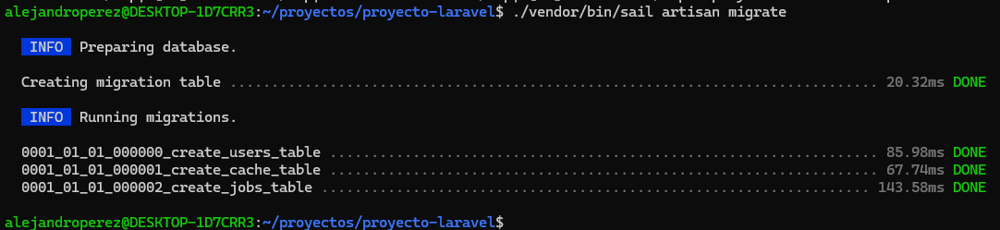

2. Prueba de acceso: Abre tu navegador web y dirígete a la siguiente dirección: http://localhost

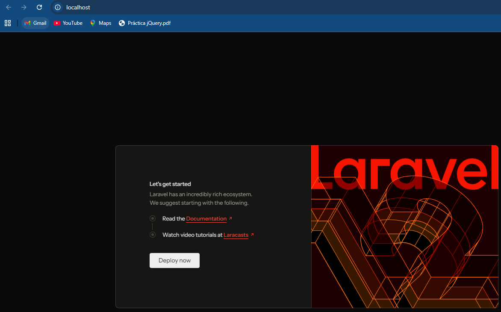

## Comandos Útiles de Mantenimiento

Para gestionar el entorno de forma eficiente, utiliza los siguientes comandos:

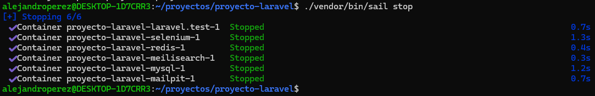

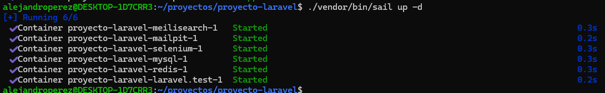

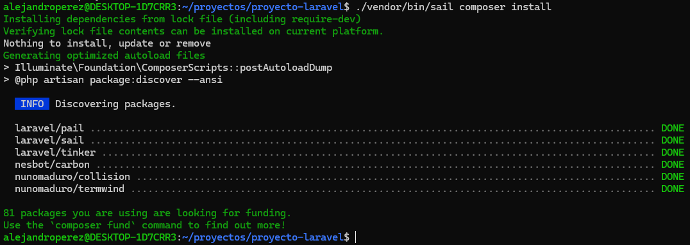

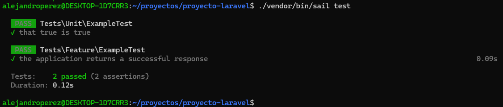

## Si lo haces con podman en lugar de docker

**Activar el servicio de podman.socket a nivel de usuario**

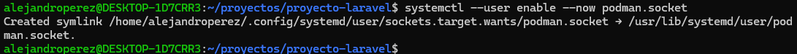

**Cambiar puerto por defecto**

Edita el fichero .env del directorio nombre-del-proyecto y escribe o cambia la variable APP_PORT a 8080 por ejemplo.

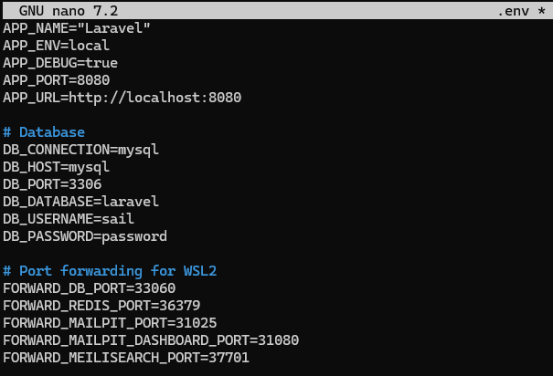

**Establecer identificador de usuario y grupo**

Anota los números que te salen:

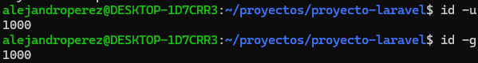

Abre el archivo .env y añade las siguientes líneas (ajuste los valores si los obtenidos anteriormente son distintos):

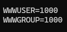